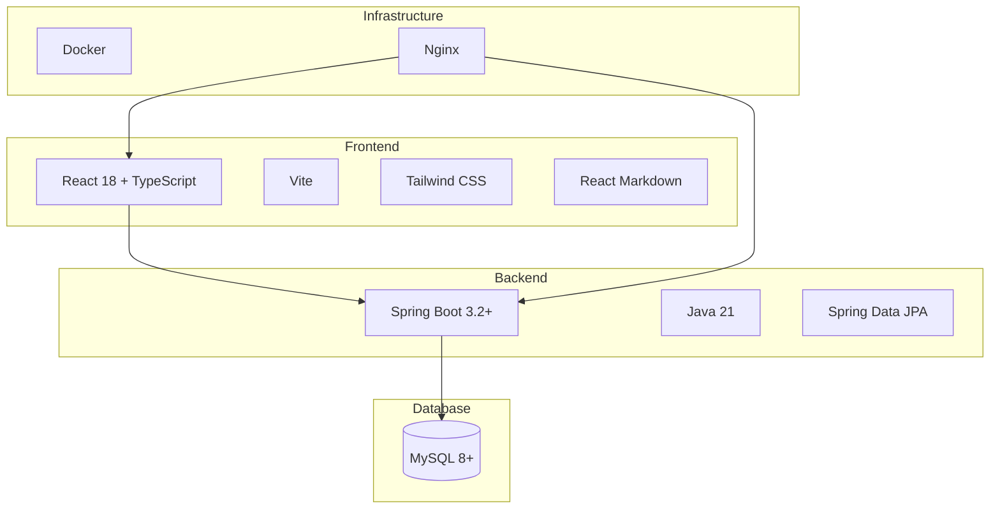
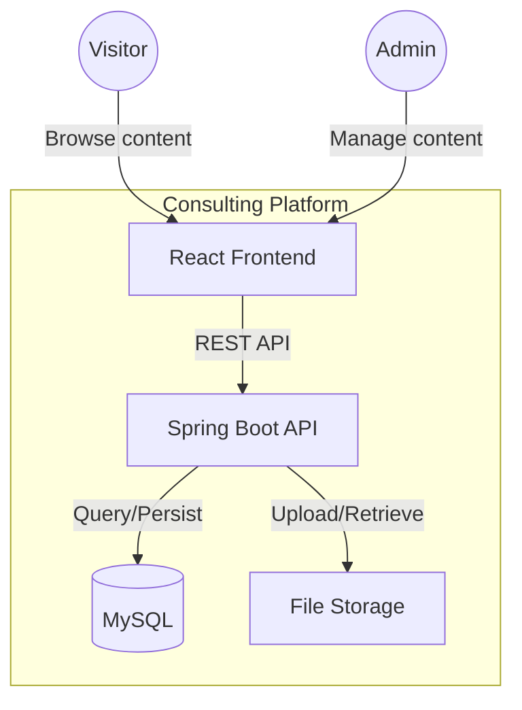
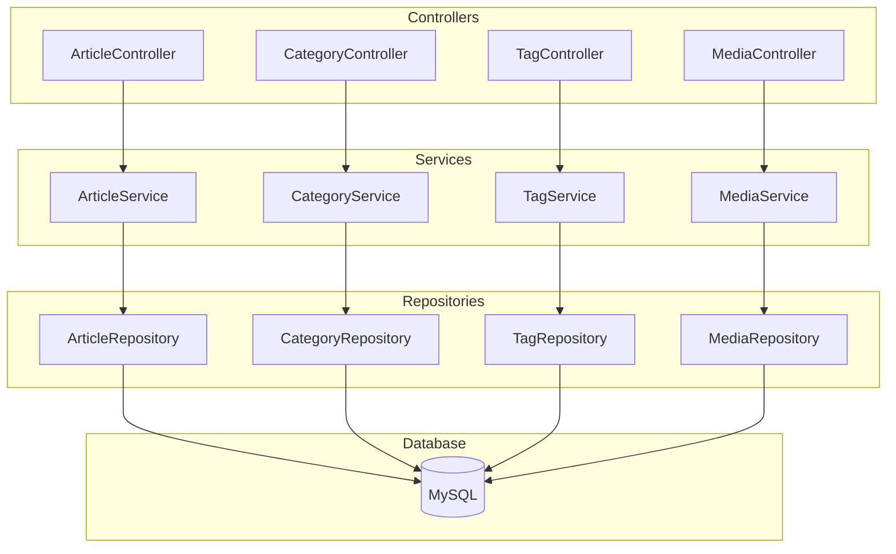
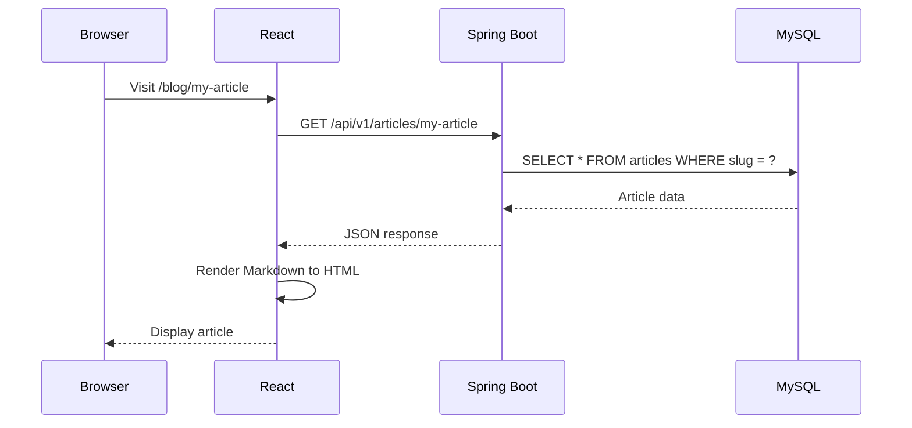
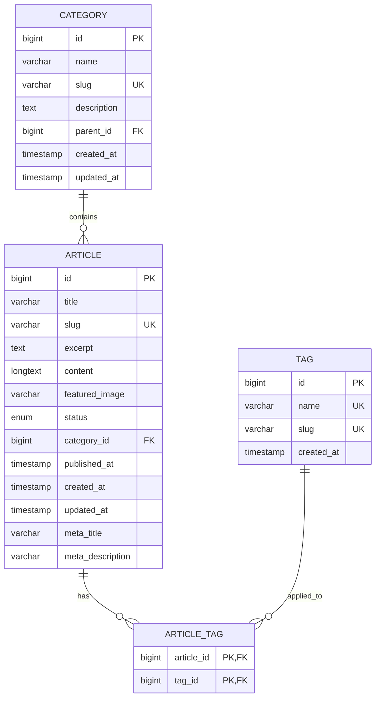
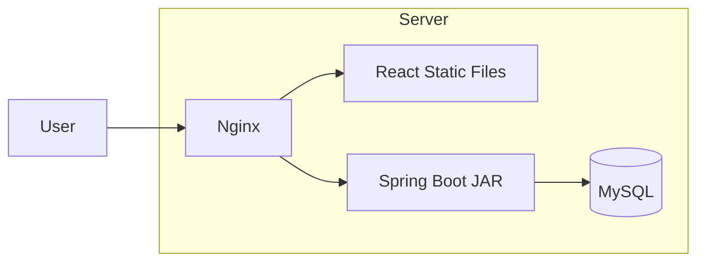
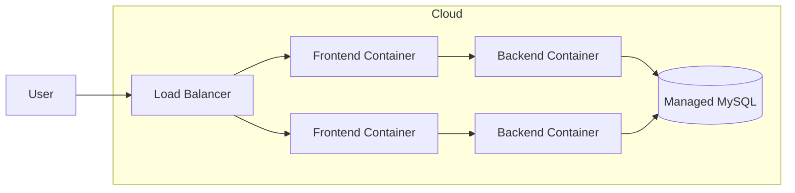

# Consulting Company Website - Implementation Plan

## Technology Stack

### Overview



### Frontend Stack

| Technology | Version | Purpose |
|------------|---------|---------|
| React | 18+ | UI framework |
| TypeScript | 5+ | Type safety |
| Vite | 5+ | Build tool and dev server |
| React Router | 6+ | Client-side routing |
| TanStack Query | 5+ | Server state management |
| Tailwind CSS | 3+ | Styling |
| react-markdown | latest | Markdown rendering |
| react-syntax-highlighter | latest | Code highlighting |
| mermaid | latest | Diagram rendering |

### Backend Stack

| Technology | Version | Purpose |
|------------|---------|---------|
| Java | 21 (LTS) | Runtime |
| Spring Boot | 3.2+ | Application framework |
| Spring Data JPA | - | Database access |
| Spring Security | - | Authentication (Phase 4) |
| Gradle | 8+ | Build tool (Kotlin DSL) |
| Flyway | - | Database migrations |
| Lombok | - | Boilerplate reduction |
| MapStruct | - | DTO mapping |
| SpringDoc OpenAPI | - | API documentation |

### Database

| Technology | Version | Purpose |
|------------|---------|---------|
| MySQL | 8+ | Primary data store |

### Infrastructure

| Technology | Purpose |
|------------|---------|
| Docker | Containerization |
| Docker Compose | Local development |
| Nginx | Reverse proxy, static serving |

---

## Architecture

### System Context



### Backend Architecture



### Request Flow



---

## Project Structure

### Monorepo Layout

```
consulting-platform/
├── backend/                    # Spring Boot application
├── frontend/                   # React application
├── docker/                     # Docker configurations
├── docs/                       # Documentation
│   ├── SPECIFICATION.md
│   ├── IMPLEMENTATION.md
│   └── ROADMAP.md
├── docker-compose.yml
├── docker-compose.prod.yml
├── .gitignore
└── README.md
```

### Backend Structure

```
backend/
├── src/
│   ├── main/
│   │   ├── java/com/consulting/platform/
│   │   │   ├── PlatformApplication.java
│   │   │   │
│   │   │   ├── config/
│   │   │   │   ├── WebConfig.java
│   │   │   │   └── OpenApiConfig.java
│   │   │   │
│   │   │   ├── common/
│   │   │   │   ├── exception/
│   │   │   │   │   ├── GlobalExceptionHandler.java
│   │   │   │   │   └── ResourceNotFoundException.java
│   │   │   │   └── dto/
│   │   │   │       ├── ApiResponse.java
│   │   │   │       └── PagedResponse.java
│   │   │   │
│   │   │   ├── article/
│   │   │   │   ├── Article.java              # Entity
│   │   │   │   ├── ArticleStatus.java        # Enum
│   │   │   │   ├── ArticleRepository.java
│   │   │   │   ├── ArticleService.java
│   │   │   │   ├── ArticleController.java
│   │   │   │   └── dto/
│   │   │   │       ├── ArticleRequest.java
│   │   │   │       ├── ArticleResponse.java
│   │   │   │       └── ArticleSummary.java
│   │   │   │
│   │   │   ├── category/
│   │   │   │   ├── Category.java
│   │   │   │   ├── CategoryRepository.java
│   │   │   │   ├── CategoryService.java
│   │   │   │   ├── CategoryController.java
│   │   │   │   └── dto/
│   │   │   │
│   │   │   ├── tag/
│   │   │   │   ├── Tag.java
│   │   │   │   ├── TagRepository.java
│   │   │   │   ├── TagService.java
│   │   │   │   ├── TagController.java
│   │   │   │   └── dto/
│   │   │   │
│   │   │   └── media/                        # Phase 2
│   │   │
│   │   └── resources/
│   │       ├── application.yml
│   │       ├── application-dev.yml
│   │       ├── application-prod.yml
│   │       └── db/migration/
│   │           ├── V1__create_categories.sql
│   │           ├── V2__create_tags.sql
│   │           └── V3__create_articles.sql
│   │
│   └── test/
│       └── java/com/consulting/platform/
│           ├── article/
│           │   ├── ArticleServiceTest.java
│           │   └── ArticleControllerTest.java
│           └── ...
│
├── build.gradle.kts
└── settings.gradle.kts
```

### Frontend Structure

```
frontend/
├── public/
│   └── favicon.ico
├── src/
│   ├── api/
│   │   ├── client.ts              # Axios instance
│   │   ├── articles.ts            # Article API calls
│   │   ├── categories.ts
│   │   └── tags.ts
│   │
│   ├── components/
│   │   ├── layout/
│   │   │   ├── Header.tsx
│   │   │   ├── Footer.tsx
│   │   │   └── Layout.tsx
│   │   │
│   │   ├── article/
│   │   │   ├── ArticleCard.tsx
│   │   │   ├── ArticleList.tsx
│   │   │   └── ArticleContent.tsx
│   │   │
│   │   ├── markdown/
│   │   │   ├── MarkdownRenderer.tsx
│   │   │   ├── CodeBlock.tsx
│   │   │   └── MermaidDiagram.tsx
│   │   │
│   │   └── ui/
│   │       ├── Button.tsx
│   │       ├── Card.tsx
│   │       └── Pagination.tsx
│   │
│   ├── pages/
│   │   ├── HomePage.tsx
│   │   ├── BlogListPage.tsx
│   │   ├── BlogPostPage.tsx
│   │   ├── CategoryPage.tsx
│   │   └── admin/
│   │       ├── AdminLayout.tsx
│   │       ├── ArticleListPage.tsx
│   │       └── ArticleEditorPage.tsx
│   │
│   ├── hooks/
│   │   ├── useArticles.ts
│   │   ├── useArticle.ts
│   │   └── useCategories.ts
│   │
│   ├── types/
│   │   ├── article.ts
│   │   ├── category.ts
│   │   └── api.ts
│   │
│   ├── App.tsx
│   ├── main.tsx
│   └── router.tsx
│
├── index.html
├── package.json
├── tsconfig.json
├── tailwind.config.js
└── vite.config.ts
```

---

## Database Schema

### Phase 1: Blog Publishing



### SQL Migrations

**V1__create_categories.sql**
```sql
CREATE TABLE categories (
    id BIGINT PRIMARY KEY AUTO_INCREMENT,
    name VARCHAR(100) NOT NULL,
    slug VARCHAR(100) NOT NULL UNIQUE,
    description TEXT,
    parent_id BIGINT,
    created_at TIMESTAMP DEFAULT CURRENT_TIMESTAMP,
    updated_at TIMESTAMP DEFAULT CURRENT_TIMESTAMP ON UPDATE CURRENT_TIMESTAMP,
    FOREIGN KEY (parent_id) REFERENCES categories(id) ON DELETE SET NULL,
    INDEX idx_slug (slug)
);
```

**V2__create_tags.sql**
```sql
CREATE TABLE tags (
    id BIGINT PRIMARY KEY AUTO_INCREMENT,
    name VARCHAR(50) NOT NULL UNIQUE,
    slug VARCHAR(50) NOT NULL UNIQUE,
    created_at TIMESTAMP DEFAULT CURRENT_TIMESTAMP,
    INDEX idx_slug (slug)
);
```

**V3__create_articles.sql**
```sql
CREATE TABLE articles (
    id BIGINT PRIMARY KEY AUTO_INCREMENT,
    title VARCHAR(255) NOT NULL,
    slug VARCHAR(255) NOT NULL UNIQUE,
    excerpt TEXT,
    content LONGTEXT NOT NULL,
    featured_image VARCHAR(500),
    status ENUM('DRAFT', 'PUBLISHED', 'ARCHIVED') DEFAULT 'DRAFT',
    category_id BIGINT,
    published_at TIMESTAMP NULL,
    created_at TIMESTAMP DEFAULT CURRENT_TIMESTAMP,
    updated_at TIMESTAMP DEFAULT CURRENT_TIMESTAMP ON UPDATE CURRENT_TIMESTAMP,
    meta_title VARCHAR(255),
    meta_description VARCHAR(500),
    FOREIGN KEY (category_id) REFERENCES categories(id) ON DELETE SET NULL,
    INDEX idx_status (status),
    INDEX idx_published_at (published_at),
    INDEX idx_slug (slug),
    FULLTEXT INDEX idx_search (title, content)
);

CREATE TABLE article_tags (
    article_id BIGINT NOT NULL,
    tag_id BIGINT NOT NULL,
    PRIMARY KEY (article_id, tag_id),
    FOREIGN KEY (article_id) REFERENCES articles(id) ON DELETE CASCADE,
    FOREIGN KEY (tag_id) REFERENCES tags(id) ON DELETE CASCADE
);
```

---

## API Design

### Base URL
```
/api/v1
```

### Public Endpoints (Phase 1)

| Method | Endpoint | Description |
|--------|----------|-------------|
| GET | `/articles` | List published articles (paginated) |
| GET | `/articles/{slug}` | Get article by slug |
| GET | `/articles/category/{slug}` | Articles by category |
| GET | `/articles/tag/{slug}` | Articles by tag |
| GET | `/categories` | List all categories |
| GET | `/tags` | List all tags |

### Admin Endpoints (Phase 1)

| Method | Endpoint | Description |
|--------|----------|-------------|
| GET | `/admin/articles` | List all articles (any status) |
| POST | `/admin/articles` | Create article |
| GET | `/admin/articles/{id}` | Get article by ID |
| PUT | `/admin/articles/{id}` | Update article |
| DELETE | `/admin/articles/{id}` | Delete article |
| PATCH | `/admin/articles/{id}/publish` | Publish article |
| POST | `/admin/categories` | Create category |
| PUT | `/admin/categories/{id}` | Update category |
| DELETE | `/admin/categories/{id}` | Delete category |
| POST | `/admin/tags` | Create tag |
| DELETE | `/admin/tags/{id}` | Delete tag |

### Request/Response Examples

**GET /api/v1/articles**
```json
{
  "data": [
    {
      "id": 1,
      "title": "Getting Started with Spring Boot",
      "slug": "getting-started-with-spring-boot",
      "excerpt": "Learn the basics of Spring Boot...",
      "featuredImage": "/uploads/spring-boot.jpg",
      "category": {
        "id": 1,
        "name": "Java",
        "slug": "java"
      },
      "tags": [
        { "id": 1, "name": "Spring", "slug": "spring" }
      ],
      "publishedAt": "2024-11-20T10:00:00Z",
      "readingTimeMinutes": 5
    }
  ],
  "pagination": {
    "page": 0,
    "size": 10,
    "totalElements": 25,
    "totalPages": 3
  }
}
```

**POST /api/v1/admin/articles**
```json
{
  "title": "Getting Started with Spring Boot",
  "content": "# Introduction\n\nSpring Boot makes it easy to...",
  "excerpt": "Learn the basics of Spring Boot...",
  "categoryId": 1,
  "tagIds": [1, 2],
  "status": "DRAFT",
  "metaTitle": "Spring Boot Tutorial",
  "metaDescription": "A beginner's guide to Spring Boot"
}
```

---

## Development Environment

### Prerequisites
- Java 21 (OpenJDK or Amazon Corretto)
- Node.js 20+
- Docker & Docker Compose
- IDE: IntelliJ IDEA / VS Code

### Docker Compose (Local Development)

```yaml
version: '3.8'

services:
  mysql:
    image: mysql:8.0
    container_name: consulting-mysql
    environment:
      MYSQL_ROOT_PASSWORD: root
      MYSQL_DATABASE: consulting
      MYSQL_USER: consulting
      MYSQL_PASSWORD: consulting
    ports:
      - "3306:3306"
    volumes:
      - mysql_data:/var/lib/mysql

volumes:
  mysql_data:
```

### Running Locally

```bash
# Start database
docker-compose up -d mysql

# Start backend
cd backend
./gradlew bootRun

# Start frontend (separate terminal)
cd frontend
npm install
npm run dev
```

### Access URLs
| Service | URL |
|---------|-----|
| Frontend | http://localhost:5173 |
| Backend API | http://localhost:8080 |
| Swagger UI | http://localhost:8080/swagger-ui.html |

---

## Security Considerations

### Phase 1 (Basic)
- CORS configured for frontend origin only
- Input validation on all endpoints
- Parameterized queries (SQL injection prevention)
- Content Security Policy headers
- Rate limiting on public endpoints

### Phase 4 (With Auth)
- JWT-based authentication
- BCrypt password hashing
- Role-based access control
- CSRF protection
- Session timeout and refresh tokens

---

## Testing Strategy

### Backend Testing
| Type | Tool | Coverage Target |
|------|------|-----------------|
| Unit | JUnit 5 + Mockito | 80% |
| Integration | Spring Boot Test | Critical paths |
| API | MockMvc | All endpoints |

### Frontend Testing
| Type | Tool | Coverage Target |
|------|------|-----------------|
| Unit | Vitest | 70% |
| Component | React Testing Library | Key components |
| E2E | Playwright | Happy paths |

---

## Deployment Strategy

### Phase 1: Simple Deployment


### Future: Container Deployment


---

## Document History

| Version | Date | Author | Changes |
|---------|------|--------|---------|
| 1.0 | 2024-11 | - | Initial implementation plan |

