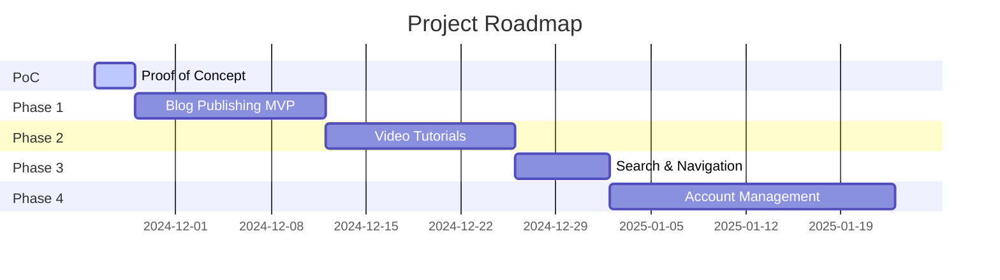
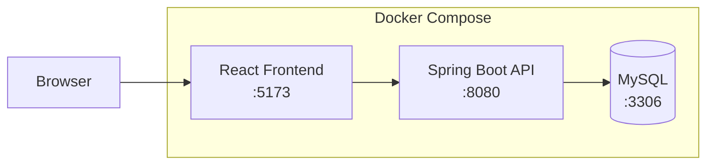

# Consulting Company Website - Roadmap

## Overview

This roadmap will be populated with stories and tasks as development progresses. It provides visibility into what will be delivered and when.

---

## Release Timeline

> **Note:** Timeline to be updated once development begins. Dates above are placeholders.

---

## PoC: Proof of Concept

### Goal
Validate the technology stack and architecture by building a minimal working system that runs locally in Docker containers.

### Success Criteria
- [ ] All services start with a single `docker-compose up` command
- [ ] Backend API responds to health check
- [ ] Frontend loads and displays data from backend
- [ ] Database persists data between restarts
- [ ] Markdown content renders correctly in browser

### Architecture Validation

### Epic: Infrastructure Setup

| Story | Tasks | Status |
|-------|-------|--------|
| **Initialize Monorepo** | | Not Started |
| | Create project root structure | |
| | Configure root .gitignore | |
| | Create docs folder with specs | |
| **Setup Backend Project** | | Not Started |
| | Initialize Spring Boot 3.2 with Gradle | |
| | Add dependencies (JPA, Web, Validation, Flyway, Lombok, MapStruct) | |
| | Configure application.yml for dev profile | |
| | Create health check endpoint | |
| **Setup Frontend Project** | | Not Started |
| | Initialize Vite + React + TypeScript | |
| | Add Tailwind CSS | |
| | Add React Router | |
| | Add TanStack Query | |
| | Create basic layout component | |
| **Setup Docker Environment** | | Not Started |
| | Create docker-compose.yml with MySQL | |
| | Create Dockerfile for backend | |
| | Create Dockerfile for frontend | |
| | Configure Nginx reverse proxy | |
| | Test full stack startup | |

### Epic: Vertical Slice

| Story | Tasks | Status |
|-------|-------|--------|
| **Create Sample Entity** | | Not Started |
| | Create Article entity (minimal fields) | |
| | Create Flyway migration | |
| | Create ArticleRepository | |
| **Create Sample API** | | Not Started |
| | Create ArticleService | |
| | Create ArticleController (GET list, GET by slug) | |
| | Create ArticleResponse DTO | |
| | Create ArticleMapper with MapStruct | |
| | Add sample data via migration | |
| **Create Sample UI** | | Not Started |
| | Create API client with Axios | |
| | Create useArticles hook with TanStack Query | |
| | Create ArticleList component | |
| | Create ArticleCard component | |
| | Display list on home page | |
| **Markdown Rendering** | | Not Started |
| | Add react-markdown dependency | |
| | Add react-syntax-highlighter | |
| | Create MarkdownRenderer component | |
| | Create article detail page | |
| | Test code block highlighting | |

### Deliverables
1. `docker-compose up` starts entire stack
2. Homepage displays list of sample articles from database
3. Clicking article shows detail page with rendered Markdown
4. Code blocks display with syntax highlighting
5. README with setup instructions

---

## Phase 1: Blog Publishing MVP

### Epic: Article Management

| Story | Tasks | Status |
|-------|-------|--------|
| **Complete Article API** | | Not Started |
| | Add all Article fields (excerpt, featured_image, meta fields) | |
| | Implement full CRUD operations | |
| | Add input validation | |
| | Add slug generation | |
| | Add article status (DRAFT/PUBLISHED/ARCHIVED) | |
| | Write unit tests | |
| | Write integration tests | |
| **Display Articles** | | Not Started |
| | Enhance article list with excerpts | |
| | Add featured images | |
| | Display publication date and reading time | |
| | Implement pagination | |
| | Add loading and error states | |
| **Admin Article Management** | | Not Started |
| | Create admin route/layout | |
| | Build admin article list view | |
| | Build Markdown editor with live preview | |
| | Implement create article form | |
| | Implement edit article form | |
| | Add delete with confirmation | |
| | Add publish/unpublish toggle | |

### Epic: Categories & Tags

| Story | Tasks | Status |
|-------|-------|--------|
| **Category Management** | | Not Started |
| | Create Category entity and migration | |
| | Create Category API (CRUD) | |
| | Add category to Article entity | |
| | Add category filter on blog list | |
| | Build admin category management | |
| **Tag Management** | | Not Started |
| | Create Tag entity and migration | |
| | Create many-to-many with Article | |
| | Create Tag API | |
| | Add tag filter on blog list | |
| | Build admin tag management | |

### Epic: Polish & SEO

| Story | Tasks | Status |
|-------|-------|--------|
| **SEO Implementation** | | Not Started |
| | Add meta tags to article pages | |
| | Generate sitemap.xml endpoint | |
| | Add OpenGraph tags | |
| | Implement clean URLs | |
| **Responsive Design** | | Not Started |
| | Mobile layout optimization | |
| | Tablet layout optimization | |
| | Cross-browser testing | |

---

## Phase 2: Video Tutorials

| Story | Tasks | Status |
|-------|-------|--------|
| **Video Upload** | | Not Started |
| | Design media storage solution | |
| | Implement video upload API | |
| | Add upload progress tracking | |
| | Create video metadata management | |
| **Video Playback** | | Not Started |
| | Integrate video player component | |
| | Build tutorial listing page | |
| | Create tutorial detail page | |
| | Add video series/playlist support | |

---

## Phase 3: Search & Navigation

| Story | Tasks | Status |
|-------|-------|--------|
| **Full-Text Search** | | Not Started |
| | Implement search API endpoint | |
| | Build search UI component | |
| | Add search results page | |
| | Implement result highlighting | |
| **Enhanced Navigation** | | Not Started |
| | Add breadcrumb navigation | |
| | Implement related content | |
| | Add popular/recent widgets | |

---

## Phase 4: Account Management

| Story | Tasks | Status |
|-------|-------|--------|
| **User Authentication** | | Not Started |
| | Implement user registration | |
| | Build login/logout flow | |
| | Add password reset | |
| | Integrate JWT tokens | |
| **User Features** | | Not Started |
| | Create user profiles | |
| | Add article bookmarking | |
| | Implement comments | |
| | Build newsletter subscription | |

---

## Backlog

Items for future consideration:

- [ ] Social media sharing
- [ ] Analytics dashboard
- [ ] Content recommendations (ML-based)
- [ ] Multi-language support
- [ ] Dark mode theme
- [ ] RSS feed
- [ ] Email notifications
- [ ] Export content (PDF)
- [ ] Permanent hosting solution (AWS/GCP/Azure)
- [ ] CI/CD pipeline

---

## How to Update This Roadmap

1. When starting a story, change status to **In Progress**
2. When completing a story, change status to **Done**
3. Add new stories/tasks as they are identified
4. Update the Gantt chart dates as estimates improve

---

## Document History

| Version | Date | Author | Changes |
|---------|------|--------|---------|
| 1.0 | 2024-11 | - | Initial roadmap structure |
| 1.1 | 2024-11 | - | Added PoC phase for stack validation |

