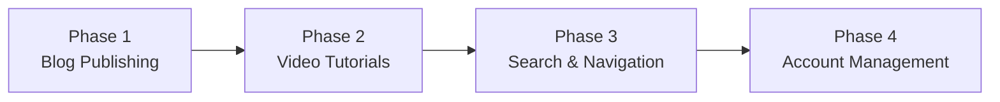

# Consulting Company Website - Specification

## Project Overview

A content publishing platform for a consulting company to share expertise through blog articles and video tutorials.

---

## Phased Delivery



| Phase | Focus | Status |
|-------|-------|--------|
| 1 | Markdown Blog Publishing | Planned |
| 2 | Video Tutorial Uploads | Future |
| 3 | Enhanced Search & Navigation | Future |
| 4 | User Accounts & Auth | Future |

---

## Phase 1: Blog Publishing

### Overview
Enable publishing and rendering of blog articles written in Markdown with syntax highlighting for code blocks.

### Functional Requirements

#### FR-1: Article Management
| ID | Requirement | Priority |
|----|-------------|----------|
| FR-1.1 | Admin can create a new blog article with title, content (Markdown), and excerpt | Must |
| FR-1.2 | Admin can edit existing articles | Must |
| FR-1.3 | Admin can delete articles | Must |
| FR-1.4 | Admin can save articles as draft or publish immediately | Must |
| FR-1.5 | Admin can schedule articles for future publication | Should |
| FR-1.6 | System generates URL-friendly slug from title | Must |
| FR-1.7 | Admin can override auto-generated slug | Should |

#### FR-2: Markdown Rendering
| ID | Requirement | Priority |
|----|-------------|----------|
| FR-2.1 | System renders Markdown content as HTML | Must |
| FR-2.2 | System highlights code blocks with syntax coloring | Must |
| FR-2.3 | System renders images embedded in Markdown | Must |
| FR-2.4 | System renders tables in Markdown | Must |
| FR-2.5 | System renders Mermaid diagrams in Markdown | Should |
| FR-2.6 | System generates table of contents from headings | Should |

#### FR-3: Article Display
| ID | Requirement | Priority |
|----|-------------|----------|
| FR-3.1 | Visitors can view list of published articles | Must |
| FR-3.2 | Visitors can read full article content | Must |
| FR-3.3 | Articles display publication date and reading time | Must |
| FR-3.4 | Articles display author name | Should |
| FR-3.5 | Article list shows pagination | Must |
| FR-3.6 | Articles can have a featured image | Should |

#### FR-4: Categories & Tags
| ID | Requirement | Priority |
|----|-------------|----------|
| FR-4.1 | Admin can create and manage categories | Must |
| FR-4.2 | Admin can assign one category per article | Must |
| FR-4.3 | Admin can create and manage tags | Must |
| FR-4.4 | Admin can assign multiple tags per article | Must |
| FR-4.5 | Visitors can filter articles by category | Must |
| FR-4.6 | Visitors can filter articles by tag | Must |

### Non-Functional Requirements

#### NFR-1: Performance
| ID | Requirement | Target |
|----|-------------|--------|
| NFR-1.1 | Article list page load time | < 2 seconds |
| NFR-1.2 | Individual article page load time | < 1.5 seconds |
| NFR-1.3 | Admin dashboard response time | < 2 seconds |

#### NFR-2: Usability
| ID | Requirement |
|----|-------------|
| NFR-2.1 | Site must be responsive (mobile, tablet, desktop) |
| NFR-2.2 | Site must be accessible (WCAG 2.1 AA) |
| NFR-2.3 | Admin interface must have live Markdown preview |

#### NFR-3: SEO
| ID | Requirement |
|----|-------------|
| NFR-3.1 | Each article must have customizable meta title |
| NFR-3.2 | Each article must have customizable meta description |
| NFR-3.3 | System must generate sitemap.xml |
| NFR-3.4 | URLs must be clean and readable (/blog/my-article-title) |

### Acceptance Criteria

#### AC-1: Create and Publish Article
```gherkin
Given I am logged in as an admin
When I create a new article with:
  | Field   | Value                        |
  | Title   | Getting Started with Java    |
  | Content | # Introduction\n\nThis is... |
  | Status  | Published                    |
Then the article appears in the public blog list
And the article is accessible at /blog/getting-started-with-java
And the Markdown content is rendered as HTML
```

#### AC-2: Code Syntax Highlighting
```gherkin
Given an article contains the following Markdown:
  """
  ```java
  public class Hello {
      public static void main(String[] args) {
          System.out.println("Hello");
      }
  }
  ```
  """
When a visitor views the article
Then the code block displays with Java syntax highlighting
And line numbers are optionally visible
```

#### AC-3: Filter by Category
```gherkin
Given articles exist in categories "Java" and "DevOps"
When a visitor clicks on the "Java" category
Then only articles in the "Java" category are displayed
And the URL reflects the filter (/blog/category/java)
```

#### AC-4: Responsive Design
```gherkin
Given a visitor accesses the blog on a mobile device
When they view the article list
Then the layout adapts to the screen width
And all content remains readable and accessible
```

---

## Phase 2: Video Tutorials

### Overview
Enable uploading and organizing video tutorial content with descriptions and metadata.

### Functional Requirements

#### FR-5: Video Upload
| ID | Requirement | Priority |
|----|-------------|----------|
| FR-5.1 | Admin can upload video files | Must |
| FR-5.2 | System accepts MP4, WebM formats | Must |
| FR-5.3 | Admin can add title and description to videos | Must |
| FR-5.4 | Admin can set thumbnail image | Should |
| FR-5.5 | System shows upload progress | Must |
| FR-5.6 | Admin can organize videos into series/playlists | Should |

#### FR-6: Video Display
| ID | Requirement | Priority |
|----|-------------|----------|
| FR-6.1 | Visitors can browse video tutorials | Must |
| FR-6.2 | Visitors can play videos in browser | Must |
| FR-6.3 | Video player supports playback controls | Must |
| FR-6.4 | Videos display duration and view count | Should |
| FR-6.5 | Videos can have associated Markdown notes | Should |

### Acceptance Criteria

#### AC-5: Upload Video Tutorial
```gherkin
Given I am logged in as an admin
When I upload a video file (MP4, < 500MB)
And I provide title "Spring Boot Basics"
And I provide a description in Markdown
Then the video is stored and processed
And the tutorial appears in the tutorials list
```

---

## Phase 3: Search & Navigation

### Overview
Implement full-text search and improved navigation across all content types.

### Functional Requirements

#### FR-7: Search
| ID | Requirement | Priority |
|----|-------------|----------|
| FR-7.1 | Visitors can search across all content | Must |
| FR-7.2 | Search results show relevant snippets | Must |
| FR-7.3 | Search supports filtering by content type | Should |
| FR-7.4 | Search provides auto-suggestions | Could |
| FR-7.5 | Search results are ranked by relevance | Must |

#### FR-8: Navigation
| ID | Requirement | Priority |
|----|-------------|----------|
| FR-8.1 | Site has clear main navigation menu | Must |
| FR-8.2 | Related content suggestions on articles | Should |
| FR-8.3 | Breadcrumb navigation on all pages | Should |
| FR-8.4 | Popular/recent content widgets | Should |

### Acceptance Criteria

#### AC-6: Search Content
```gherkin
Given articles and tutorials exist containing "Spring Boot"
When a visitor searches for "Spring Boot"
Then results from both articles and tutorials appear
And each result shows title, type, and excerpt
And results are ordered by relevance
```

---

## Phase 4: Account Management

### Overview
Enable user registration, authentication, and personalized features.

### Functional Requirements

#### FR-9: Authentication
| ID | Requirement | Priority |
|----|-------------|----------|
| FR-9.1 | Users can register with email | Must |
| FR-9.2 | Users can log in with email/password | Must |
| FR-9.3 | Users can reset forgotten password | Must |
| FR-9.4 | Users can log in with Google/GitHub OAuth | Should |
| FR-9.5 | System supports role-based access (Admin, Author, User) | Must |

#### FR-10: User Features
| ID | Requirement | Priority |
|----|-------------|----------|
| FR-10.1 | Users can bookmark articles | Should |
| FR-10.2 | Users can comment on articles | Should |
| FR-10.3 | Users can subscribe to newsletter | Should |
| FR-10.4 | Users have profile pages | Could |

---

## Glossary

| Term | Definition |
|------|------------|
| Article | A blog post written in Markdown |
| Tutorial | A video-based learning resource |
| Category | A hierarchical classification for content |
| Tag | A flat label for cross-cutting topics |
| Slug | URL-friendly version of a title |
| Admin | User with full content management access |
| Author | User who can create/edit own content |
| Visitor | Anonymous user browsing public content |

---

## Document History

| Version | Date | Author | Changes |
|---------|------|--------|---------|
| 1.0 | 2024-11 | - | Initial specification |

